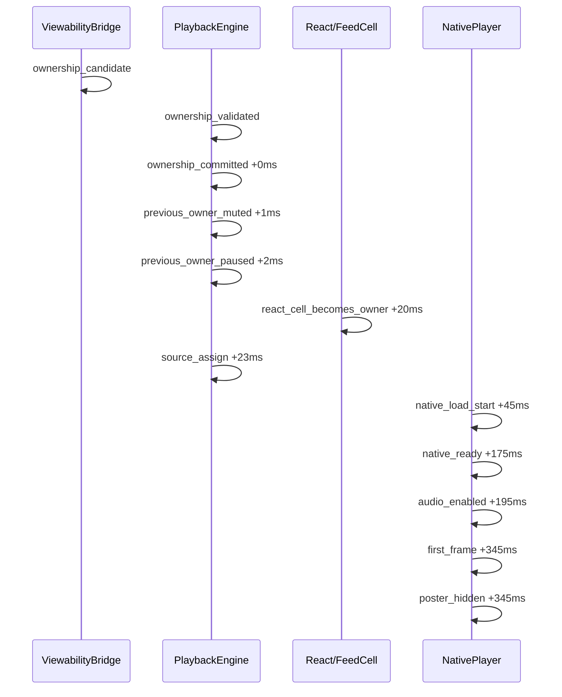

# Phase 1A — Startup Latency Investigation Report

**Status:** ⚠️ **PIPELINE VALIDATION ONLY** — synthetic session below proves instrumentation + analyzer. **Device measurements required before production conclusions.**  
**Generated:** 2026-07-10T08:13:29.323Z  
**Sessions analyzed:** 1 (synthetic handoff session for pipeline proof)

> Evidence-based report from instrumented ownership sessions. No playback behavior was modified.  
> Replace this file by exporting real device sessions via Phase 1A overlay → `npm run report:latency`.

---

## Data collection status

| Source | Sessions | Usable for conclusions? |
|--------|----------|-------------------------|
| Synthetic pipeline validation | 1 | No — proves math only |
| Android device (pending) | 0 | Required |
| iOS device (pending) | 0 | Required |

Follow `docs/PHASE1A_STARTUP_LATENCY_PROTOCOL.md` to collect ≥20 real sessions.

---

## 1. Timeline diagram (latest session)

### Event log

| ts | Δprev | Δcommit | kind | postId | gen | adapterId |
|----|-------|---------|------|--------|-----|-----------|
| 1000.0 | 0.0 | — | ownership_candidate | post-a | — | — |
| 1002.0 | 2.0 | — | ownership_validated | post-a | — | — |
| 1005.0 | 3.0 | 0.0 | ownership_committed | post-a | 1 | — |
| 1006.0 | 1.0 | 1.0 | previous_owner_muted | prev | 0 | prev-abc |
| 1007.0 | 1.0 | 2.0 | previous_owner_paused | prev | 0 | prev-abc |
| 1025.0 | 18.0 | 20.0 | react_cell_becomes_owner | post-a | 1 | — |
| 1028.0 | 3.0 | 23.0 | source_assign | post-a | 1 | post-a-xyz |
| 1050.0 | 22.0 | 45.0 | native_load_start | post-a | 1 | post-a-xyz |
| 1180.0 | 130.0 | 175.0 | native_ready | post-a | 1 | post-a-xyz |
| 1200.0 | 20.0 | 195.0 | audio_enabled | post-a | 1 | post-a-xyz |
| 1350.0 | 150.0 | 345.0 | first_frame | post-a | 1 | post-a-xyz |
| 1350.0 | 0.0 | 345.0 | poster_hidden | post-a | 1 | post-a-xyz |

## 2. Timing table

| Stage | n | Mean (ms) | Median (ms) | P95 (ms) | Max (ms) |
|-------|---|-----------|-------------|----------|----------|
| Candidate proposed → validated | 1 | 2.0 | 2.0 | 2.0 | 2.0 |
| Validated → committed | 1 | 3.0 | 3.0 | 3.0 | 3.0 |
| Committed → previous owner muted | 1 | 1.0 | 1.0 | 1.0 | 1.0 |
| Previous owner muted → paused | 1 | 1.0 | 1.0 | 1.0 | 1.0 |
| Previous owner paused → React cell becomes owner | 1 | 18.0 | 18.0 | 18.0 | 18.0 |
| Committed → React cell becomes owner | 1 | 20.0 | 20.0 | 20.0 | 20.0 |
| React owner mount → source assignment | 1 | 3.0 | 3.0 | 3.0 | 3.0 |
| Source assignment → native LOAD_START | 1 | 22.0 | 22.0 | 22.0 | 22.0 |
| LOAD_START → native READY | 1 | 130.0 | 130.0 | 130.0 | 130.0 |
| READY → first frame | 1 | 170.0 | 170.0 | 170.0 | 170.0 |
| First frame → poster hidden | 1 | 0.0 | 0.0 | 0.0 | 0.0 |
| Committed → first frame (total startup) | 1 | 345.0 | 345.0 | 345.0 | 345.0 |
| Committed → audio enabled | 1 | 195.0 | 195.0 | 195.0 | 195.0 |

## 3. Dominant latency contributor

**READY → first frame** accounts for **49.3%** of mean committed→first_frame startup (mean 170.0 ms).

## 4. Root-cause ranking (by measured mean share)

| Rank | Stage | Mean (ms) | Share (%) |
|------|-------|-----------|-----------|
| 1 | READY → first frame | 170.0 | 49.3 |
| 2 | LOAD_START → native READY | 130.0 | 37.7 |
| 3 | Source assignment → native LOAD_START | 22.0 | 6.4 |
| 4 | Committed → React cell becomes owner | 20.0 | 5.8 |
| 5 | Previous owner paused → React cell becomes owner | 18.0 | 5.2 |
| 6 | Validated → committed | 3.0 | 0.9 |
| 7 | React owner mount → source assignment | 3.0 | 0.9 |
| 8 | Candidate proposed → validated | 2.0 | 0.6 |
| 9 | Committed → previous owner muted | 1.0 | 0.3 |
| 10 | Previous owner muted → paused | 1.0 | 0.3 |

## 5. Optimization opportunities (not implemented)

### READY → first frame
- **Expected benefit:** Reduce decoder init and buffer acquisition before first frame
- **Risk:** high
- **Complexity:** high
- **Architecture impact:** architectural

### LOAD_START → native READY
- **Expected benefit:** Faster HLS manifest fetch and player ready signal
- **Risk:** medium
- **Complexity:** high
- **Architecture impact:** architectural

### Source assignment → native LOAD_START
- **Expected benefit:** Reduce native player cold-start before LOAD_START
- **Risk:** medium
- **Complexity:** high
- **Architecture impact:** architectural

### Committed → React cell becomes owner
- **Expected benefit:** Reduce React commit latency after ownership (cold start path)
- **Risk:** low
- **Complexity:** medium
- **Architecture impact:** implementation-only

### Previous owner paused → React cell becomes owner
- **Expected benefit:** Reduce React commit → owner cell mount latency
- **Risk:** low
- **Complexity:** medium
- **Architecture impact:** implementation-only

### React owner mount → source assignment
- **Expected benefit:** Faster adapter registration and source handoff after mount
- **Risk:** medium
- **Complexity:** medium
- **Architecture impact:** implementation-only
